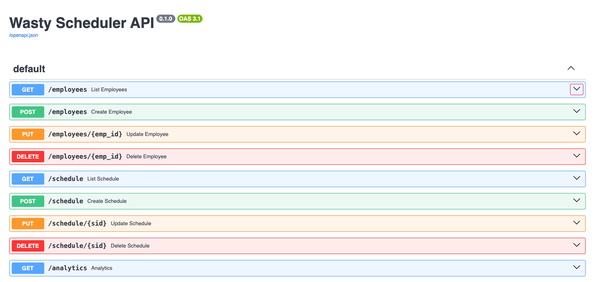
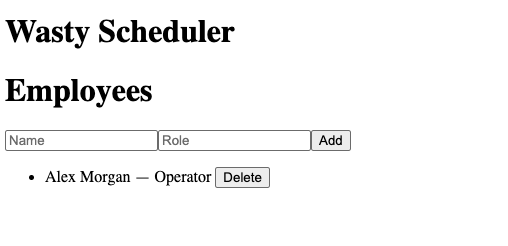
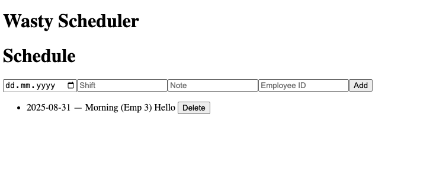
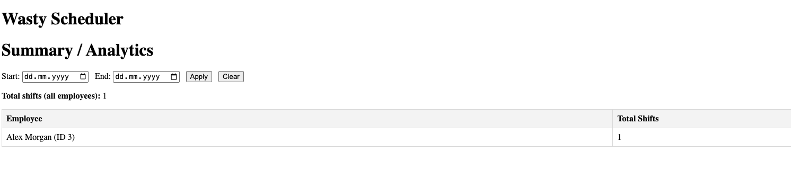
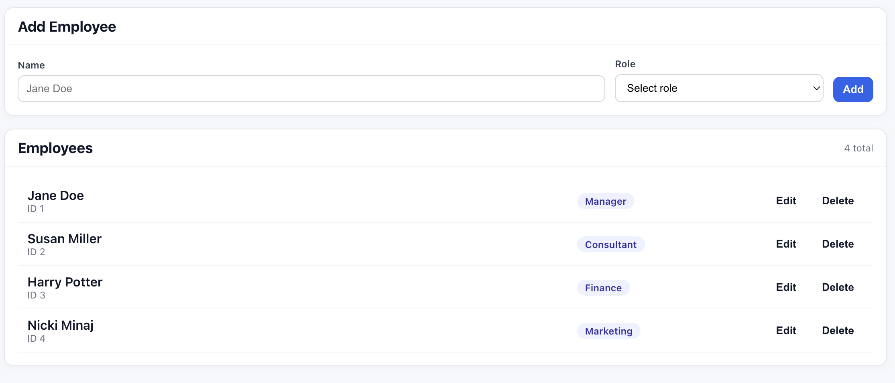
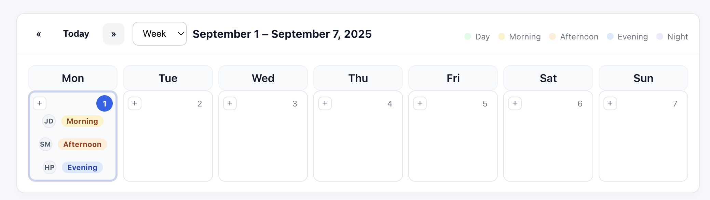
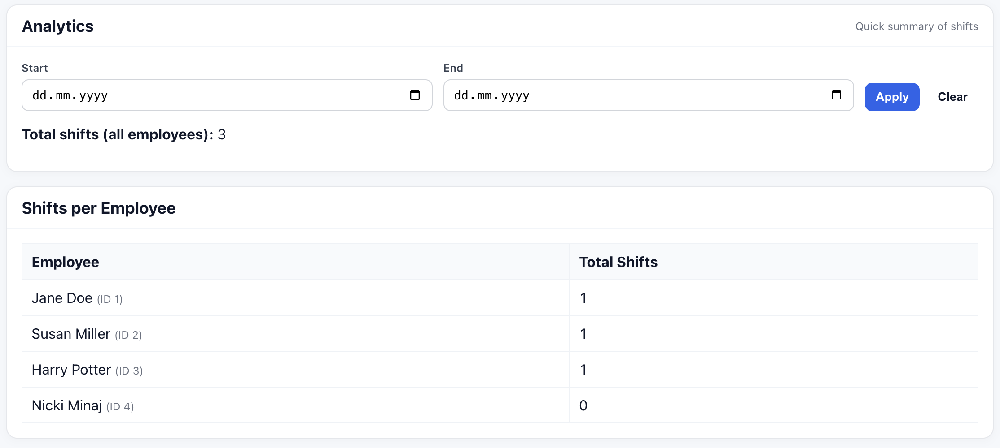

# Getting Started with Wasty Scheduler -- My Journey

## 0. Research & Learning

- Goal: understand enough Angular + FastAPI to fulfill the task
- Materials: crash courses on Angular, FastAPI, Pydantic + SQLAlchemy.

## 1. Project Setup

- Repo layout: `web/` (Angular) and `api/` (FastAPI)
- Tooling: Angular CLI for dev server and build; Uvicorn for API.
- CORS: allow `http://localhost:4200` in FastAPI for the Angular dev server.
- Scripts: `npm start` (web) and `uvicorn api.main:app --reload` (API).

## 2. Backend

- Stack: FastAPI + Pydantic + SQLAlchemy + SQLite.
- Models: `Employee(id,name,role)` and `Schedule(id,employee_id,date,shift,note)` with a 1→many relationship.
- Endpoints:
  - Employees: GET/POST/PUT/DELETE `/employees`.
  - Schedules: GET `/schedule?start&end`, POST/PUT/DELETE `/schedule`.
  - Analytics: GET `/analytics?start&end` (outer join, totals per employee).

## 3. Frontend

- Routing: three routes — Employees, Schedule, Summary (default redirects to Employees).
- Services: HttpClient for employees, schedules, analytics.
- State: Angular signals inside components; fetch → set signal → template renders.
- Components:
  - Employees: create/list/edit/delete employees with roles.
  - Schedule: calendar grid with per-day shifts, modal editor.
  - Summary: filter form + totals table.

## 4. Employees

- Purpose: manage the roster of employees with their roles.
- UI: add form (Name + Role) at the top; list of employees below with inline edit/delete.
- `EmployeesService` calls the API; component stores the list in a signal and re-renders on update.
- Create: form submit posts to `/employees`; on success, clears inputs and reloads.
- Edit: switches a row into edit mode; Save calls PUT `/employees/{id}`; Cancel restores view mode.
- Delete: calls DELETE `/employees/{id}` and reloads the list.
- (minimal) Validation: disables Add/Save if name or role is empty.
- Roles: fixed options ensure consistent role strings.
- Backend link: REST endpoints under `/employees`.

## 5. Schedule & Calendar

- Purpose: plan, visualize, and manage daily shifts on a month/week calendar.
- Calendar grid: custom Month/Week views + today badge.
- “+” button per cell opens the inline modal.
- Shift items are hoverable/clickable; open the same modal populated with data.
- Cell content: initials avatar + color-coded chip (Day/Morning/Afternoon/Evening/Night) + optional note.
- Ordering: within a day, shifts are sorted Day → Morning → Afternoon → Evening → Night.
- Shifts list: shows employee name and date.

## 6. Summary/Analytics

- Purpose: quick totals of shifts per employee with optional date range.
- UI: small filter form with Start/End date inputs and Apply/Clear buttons.
- Calls `AnalyticsService.get(start, end)`; stores response in a signal.
- Shows overall total and a table of `{ employee_name, total_shifts }`.
- Backend link to `GET /analytics?start=YYYY-MM-DD&end=YYYY-MM-DD`.

## 7. Styling & Layout

- CSS variables for colors and spacing; reusable `.card`, `.btn`, `.input`, `.table`, `.chip`.
- UI polish
- Navbar sticky top bar with active link highlighting.

## 8. Documentation & Workflow

- Root README: setup (API + web), endpoints, structure.
- docs/: additional information with screenshots.
